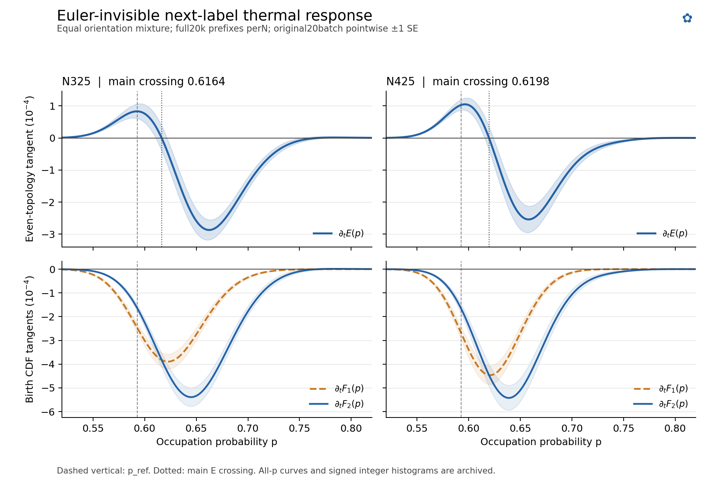

# The Euler-invisible tangent redistributes first and second birth in p

The complete saved-tail readout resolves the sign reversal left open in
`9ce53a5a`: both sizes have an early positive E lobe and a substantially
larger later negative lobe, separated at **p=.61642 for N325 and .61977 for
N425**. Both birth CDF responses are negative at both main extrema. The
exchange is therefore in **which delayed birth dominates**, not an early
acceleration followed by a late delay.

This is a response of the fixed finite-source permutation ensemble to the
specified next-label perturbation. The perturbation preserves the entire
immediate joint rank/Euler-increment distribution for every finite tilt.



## The frozen tangent, with complete signed threshold histograms

For an original R0 prefix Z, the safe degree class is
`A_e={u: next rank=0, occupied contact degree=e}`. Set
`pi_e=|A_e|/d` and `g(u)=e-c(u)`. Keep each class mass and tilt its internal
label law by `exp(t*pi_e*g(u))`, leaving all other labels unchanged, then
continue with the original uniform suffix. The derivative of any response
Y is exactly `sum_e pi_e^2 Cov(g,m_Y|Z,A_e)`.

The present readout is the equal mixture of the two **orientation-specific**
rules over the original full20k-prefix denominator per size. It is not a
common-label H4 perturbation. It uses precisely `GROUPS[2]` in
`scripts/p334_safe_contact_response.py`: own-R0, both next labels own-safe,
and `e_U=e_V`.

For each original batch, the complete signed threshold measure for birth
j is accumulated with integer weights

```
dg * (delta[K_j(U,0)] + delta[K_j(U,1)]
      - delta[K_j(V,0)] - delta[K_j(V,1)]),   dg=g(U)-g(V),
```

and divided by **64000 = 8*8000**. Both orientations enter the same batch
vector. Every F1 and F2 histogram has exactly zero total integer weight.
All40 batch histograms, selected-label counts and source-file hashes are
saved in `results/p334-euler-invisible-thermal-shape/signed_birth_histograms.json`.
No suffix was regenerated.

If h_j(k) is a signed birth histogram, its cumulative integer coefficients
give the stable, exact-form thermal transformation

\[
 H_j(p)=\sum_{n=0}^{N}\left[\sum_{k\le n}h_j(k)\right]
            {N\choose n}p^n(1-p)^{N-n}.
\]

The integer accumulation precedes floating normalization. This matters in
the tails: a tiny floating cumulative residue must not become a spurious
root near p=1. The output contains full F1/F2/A/E curves, with
`H_A=H_1+H_2` and **`H_E=H_2-H_1`**, since `E=1-F1+F2=P0+P2`.

## Main shape and common-batch uncertainty

All `+/-` values below are one original-batch SE. Extremum amplitudes use
pointwise SE at their fitted-polynomial locations; they are not
selection-adjusted peak intervals or simultaneous confidence bands.

| Quantity | N325 | N425 |
|---|---:|---:|
| Main E crossing | .61642244 | .61977134 |
| Root local-delta SE | .00538691 | .00415732 |
| Root delete-one-batch SE | .00530770 | .00415720 |
| Valid main-root LOO branches | 20/20 | 20/20 |
| Positive extremum p | .59254508 | .59645341 |
| Positive E amplitude | +.0000829907 +/-.0000222179 | +.0001048973 +/-.0000187458 |
| Negative extremum p | .66240131 | .65811668 |
| Negative E amplitude | -.0002870504 +/-.0000312012 | -.0002541608 +/-.0000411185 |
| Early positive lobe area | +.00000366895 +/-.00000115796 | +.00000434572 +/-.00000094213 |
| Main negative lobe area | -.00001960444 +/-.00000235654 | -.00001582575 +/-.00000303110 |
| Full integral E | -.00001588382 +/-.00000311394 | -.00001147484 +/-.00000364557 |

The main negative area is 5.34 and 3.64 times the early positive area.
The small difference between the two main-root locations is not established
as a size shift by these errors.

Root local-delta SE is `SE[H_E(p*)]/|H'_E(p*)|`. Each LOO deletes an entire
original1000-prefix batch; it recomputes the mean polynomial and retains
the main root only when the fixed interval `.55<p<.70` contains a unique
crossing. All20 branches are retained at each size. The full20 integer
histograms reconstruct the covariance of every curve point and every
linear integral; no threshold, orientation or suffix is treated as an
independent replicate. Lobe areas use exact Bernstein-basis integrals at
the point-estimate root limits; changing a root contributes zero to their
first-order differential because `H_E(p*)=0`.

### The two birth components identify the exchange

The table reports `(H1,H2)` in units of `10^-4` at the main E extrema.

| Position | N325 | N425 |
|---|---:|---:|
| Early positive E lobe | (-2.45111, -1.62120) | (-3.05186, -2.00289) |
| Later negative E lobe | (-1.91276, -4.78326) | (-1.98541, -4.52701) |

Near the early peak, first birth loses more cumulative mass than completion:
`-H1 > -H2`, so `H_E>0`. Later, completion loses more cumulative mass:
`-H2 > -H1`, so `H_E<0`. This is a spatial response redistribution through
the full two-birth evolution, although the immediate rank/Euler law was
held fixed. It does not require assigning a continuum field to the tilt.

The threshold first moments are also retained by the histograms:
`dE[K1]=.01035703/.01362344` and
`dE[K2]=.01553516/.01851172`. Thus the integrated E response is exactly
`-(dE[K2]-dE[K1])/(N+1)`. The curve tells us where that extra completion
delay is expressed; the integral is not an independent confirming signal.

## Small tail lobes and numerical scope

The ordinary numerical polynomial readout finds two sign-changing internal
roots at each size:

| N | Main root | Later root | Later positive peak: p; amplitude +/- SE |
|---|---:|---:|---:|
| 325 | .61642244 | .76740054 | .78347980; 1.35698e-6 +/-1.43931e-6 |
| 425 | .61977134 | .79084764 | .80308098; 1.99733e-7 +/-3.33562e-7 |

These late positive lobes are weaker than one SE; they do not support a
third physical response phase. The N325 later root persists in20/20 LOO
curves, the N425 later root in19/20, which does not overcome their weak
amplitudes. The exact endpoint factors of the aggregate E polynomials are
`p^195(1-p)^61` and `p^254(1-p)^86`. They are factored out before ordinary
double-precision root bracketing. We did not undertake high-precision
certification of all complex/even-multiplicity roots or reinterpret endpoint
underflow as a zero crossing.

## Scientific card and reproduction

- **Mechanism changed:** immediate rank and Euler increment fail to capture
  a spatial tangent whose first-birth and completion responses exchange
  dominance across occupation probability. The two main E lobes locate
  that exchange in the saved finite-source ensemble.
- **Not established:** stochastic ordering over every p, a continuum
  operator, the cause of unperturbed global H4, a significant size drift of
  the main root, or a genuine late third lobe.
- **Observer/sector/source/geometry:** equal orientation-specific tangent;
  F1/F2 and ordinary A/E; original paired N325/N425 e32a8593 conditional
  tails with959a7fa2 contact marks; all original20k prefixes per size.
- **Dependency group:** identical raw source and original20 batches as the
  nestedfork/contact covariance and9ce53a5a tangent. The entire curve is a
  new readout, not a new independent evidence block.
- **Next discriminating observation:** where a richer contact mark changes
  this first/completion exchange after retaining the same instantaneous
  law; no such extra collection is performed here.

The thin script `scripts/p334_euler_invisible_thermal_shape.py` provides
`extract`, `score`, and `plot` stages. Run with the existing research Python.
`score`/`plot` consume the saved integer histograms and never revisit suffix
generation. This work read the existing raw archives once, used no MC or
network solver, and added no validation campaign. PNG/SVG exports retain
the original common-batch uncertainty; the editable SVG and all-p numeric
curve are included.
